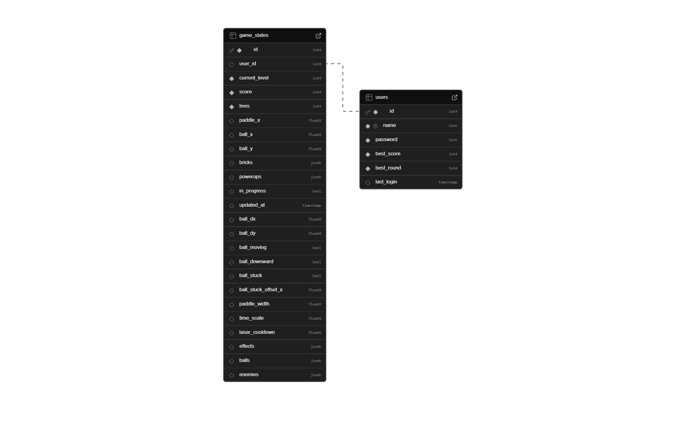

# 🎮 Arkanoid Game  
*A modern Object-Oriented remake of the classic brick-breaker arcade.*

---

## 🧩 Overview
**Arkanoid Game** is a fully object-oriented JavaFX project built to demonstrate advanced programming principles, modular architecture, and engaging gameplay mechanics.  
Players control a paddle to bounce a ball, destroy bricks, and progress through increasingly challenging levels with power-ups, enemies, and smooth scene transitions.

---

## ⚙️ Key Features
- 🧱 **Multiple Levels** with dynamic layouts and increasing difficulty  
- 💥 **Power-ups & Enemies** that modify gameplay and add strategy  
- 🎵 **Integrated Sound System** for background music and effects  
- 🎬 **Scene Transitions & Animations** for immersive flow  
- 💾 **Database-backed save system** (PostgreSQL / Supabase)  
- 🧠 **Pause, Resume, and Snapshot** features to restore gameplay seamlessly  
- 🧪 **TestFX UI Tests** and **JUnit backend tests** for reliability  

---

## 🧱 Project Architecture (MVC)

```text
src/
├── main/
│   ├── java/com/game/arkanoid/
│   │   ├── app/         → Application entry point (Main)
│   │   ├── controller/  → JavaFX controllers, scene navigation, pause/menu/login flows
│   │   ├── view/        → Renderers (Ball/Bricks/Enemy/PowerUp), transitions, HUD, sound
│   │   ├── services/    → Core game logic (GameService, Ball/Brick/Bullet/PowerUp/Enemy/Round)
│   │   ├── models/      → Entities (Ball, Paddle, Brick, Bullet, PowerUp, Enemy), GameState, Snapshot, enums
│   │   ├── events/      → GameEventBus and domain events (game, powerup, sound, enemy)
│   │   ├── repository/  → Database repositories (User/Score/GameState) and SQL loader
│   │   ├── config/      → DatabaseConfig, GameSettings (difficulty, volumes, highscores)
│   │   ├── container/   → AppContext + Container (wire services/state; lightweight DI)
│   │   └── utils/       → Constants, PasswordHasher, SqlLoader, helpers
│   └── resources/com/game/arkanoid/
│       ├── fxml/        → JavaFX layout files (Menu, Login, Rounds, Pause, GameOver, Win)
│       ├── css/         → Stylesheets
│       ├── images/      → Sprites and textures
│       ├── sounds/      → Audio resources
│       ├── levels/      → Text-based level layouts
│       └── sql/         → Queries (user/score/game_state)
└── test/                → Unit & UI tests (JUnit 5 + TestFX)
```


## 🧭 The project follows the **MVC pattern**:
- **Model:** Game state and entities  
- **View:** JavaFX visuals, renderers, and sound  
- **Controller:** Input handlers and scene management  

---

## 🧠 Object-Oriented Design Principles
| Principle         | Implementation                                                                           |
|-------------------|------------------------------------------------------------------------------------------|
| **Encapsulation** | Each entity (Ball, Paddle, Brick) maintains private state with controlled public access. |
| **Inheritance**   | MovableObject → Ball, Paddle, Bullet, Enemy share velocity logic.                        |
| **Polymorphism**  | Unified `update()` and `render()` interfaces for flexible behavior.                      |
| **Abstraction**   | Services (e.g., `GameService`, `EnemyService`) hide complex logic behind simple methods. |

---

## 🧰 Technologies Used
- ☕ **Java 25**  
- 🎨 **JavaFX 21** for GUI and animation  
- 🕹️ **FXGL Engine** for physics and game loops  
- 🧩 **PostgreSQL / Supabase** for persistent storage  
- ⚙️ **Dotenv** for environment configuration  
- 🧪 **JUnit 5 + TestFX** for automated testing  
- 🧱 **Maven** for dependency management and builds  

---

## 💾 Database Integration
The project integrates **PostgreSQL** using `DatabaseService`, handling:
- User login and signup  
- Scoreboard and ranking retrieval  
- Auto-saving game snapshots  
- Restoring “continue” state on startup  

🔐 Credentials are loaded via `.env` configuration.

---

## 🧪 Testing Strategy
- **Unit Tests:** Validate core logic (services, models, repositories)  
- **UI Tests:** `TestFX` automates FXML scene rendering and event testing  

Run all tests:
```bash
mvn clean test
```

## 🚀 How to Run

Make sure you have Java 24+ and Maven installed.
```bash
# Clone and build
git clone https://github.com/nvawntien/arkanoid.git
cd arkanoid
mvn clean install

# Run the game
mvn javafx:run
```

Or directly:
```bash
mvn exec:java -Dexec.mainClass="com.game.arkanoid.app.Main"
```

## 🎮 Controls

| Key       | Action                      |
|-----------|-----------------------------|
| ←         | Move paddle to the left     |
| →         | Move paddle to the right    |
| SPACE     | Launch ball / Shoot laser   |
| ESC       | Pause game                  |

## 🕹️ How to Play

1) Login / Signup account.
2) Press Start to start a new game.
2) Control the paddle: Use arrow keys ← and → to move left and right.
3) Launch the ball: Press SPACE to launch the ball from the paddle.
4) Destroy bricks: Bounce the ball to hit and destroy bricks.
5) Collect power-ups: Catch falling power-ups for special abilities.
6) Avoid losing the ball: Keep the ball from falling below the paddle.
7) Complete the level: Destroy all destructible bricks to advance.

## 🔋 Power-ups

| Icon | Name          | Effect                                                     |
|------|---------------|------------------------------------------------------------|
| 🟦   | Expand Paddle | Temporarily increases paddle width                         |
| 🔫   | Laser Paddle  | Enables twin laser bullets from the paddle (SPACE to fire) |
| 🎯   | Multi Ball    | Spawns 2 additional balls from the moving ball             |
| ❤️   | Extra Life    | Grants +1 life                                             |
| 🧲   | Catch Ball    | Balls stick to the paddle; press SPACE to re-launch        |
| 🐌   | Slow Ball     | Slows down overall gameplay time scale                     |


## 🧮 Scoring System

-
-
-
-

## 🧠 UML & Architecture

Visual representation of the core architecture and class relationships:



## 🧩 Design Patterns Implementation

- Observer / Publish–Subscribe (Event Bus)
  - Decouples producers and consumers of game and sound events.
  - Core: `src/main/java/com/game/arkanoid/events/GameEventBus.java`
  - Publishers: e.g. `services/BulletService.java`, `services/EnemyService.java`, `services/PowerUpService.java`
  - Consumers: e.g. `view/renderer/EnemyRenderer.java` (explosions), sound layer (sound events)

- Strategy (Transitions)
  - Transitions: interchangeable scene entry animations via a common interface.
    - Interface: `view/transition/TransitionStrategy.java`
    - Concrete strategies: `view/transition/BlurFadeStrategy.java`, `FadeTransitionStrategy.java`, `SlideFadeStrategy.java`
    - Selection: `view/transition/TransitionFactory.java` used by `view/transition/TransitionManager.java`

- Factory (TransitionFactory)
  - Creates pre-configured transition strategies based on context.
  - `src/main/java/com/game/arkanoid/view/transition/TransitionFactory.java`

- Facade
  - DatabaseService: single entry point that wraps repositories and runs DB work on a background pool.
    - `src/main/java/com/game/arkanoid/services/DatabaseService.java`
  - TransitionManager: simple API to play transitions without exposing animation details.
    - `src/main/java/com/game/arkanoid/view/transition/TransitionManager.java`
  - GameService: orchestrates sub-services (ball, bricks, powerups, bullets, enemies, rounds) behind a compact API.
    - `src/main/java/com/game/arkanoid/services/GameService.java`

- Memento (Game Snapshot)
  - Captures and restores the runtime state for Continue feature.
  - `src/main/java/com/game/arkanoid/models/GameStateSnapshot.java` (from/applyTo for `GameState`)

- Singleton 
  - Event bus singleton: `events/GameEventBus.java`
  - App services context (DB + session): `container/AppContext.java`
  - Game container (state + services wiring): `container/Container.java`

## 💡 Additional Design Choices

- Rendering: pluggable renderer interface per model type.
  - Interface: `view/renderer/Renderer.java`
  - Implementations: `view/renderer/BallsRenderer.java`, `BricksRenderer.java`, `PowerUpRenderer.java`, `EnemyRenderer.java`, `PaddleRenderer.java`, `LifeRenderer.java`, etc.

- Repository + Data Mapper (Persistence layer)
  - Abstracts SQL and maps rows to domain models/DTOs.
  - `repository/UserRepository.java`, `repository/ScoreRepository.java`, `repository/GameStateRepository.java`

## 🗄️ Database Schema

The game persists user profiles and in‑progress game snapshots:

- Users (`users`)
  - `id` (PK), `name` (unique), `password`, `best_score`, `best_round`, `last_login`
- Game States (`game_states`)
  - Core: `user_id` (FK → users.id), `current_level`, `score`, `lives`, `paddle_x`, `ball_x`, `ball_y`
  - Rehydrate hints: `paddle_width`, `ball_dx`, `ball_dy`, `ball_moving`, `ball_downward`, `ball_stuck`, `ball_stuck_offset_x`, `time_scale`, `laser_cooldown`
  - Snapshot payloads (JSONB): `bricks`, `powerups`, `enemies`, `balls`, `effects`
  - Housekeeping: `in_progress`, `updated_at`

Rankings are derived directly from `users` (best score/round), while the latest in‑progress session is loaded from `game_states` per user.



## 📺 Gameplay Demo

🎥 Watch the gameplay demo on YouTube:
👉 https://youtu.be/your-demo-link

## Authors

| Name                 | Role                                             |
| -------------------- | -------------------------------------------------|
| **Nguyễn Văn TIến**  | Leader Developer / Game logic / Event System     |   
| **Nguyễn Bảo Minh**  | Database / System Architect / Scene Management   |
| **Lê Đình Anh Tuấn** | JavaFX - FXML / UI Intergration                  | 

## 🪪 License

This project was developed for academic and demonstration purposes.  
It is **not covered by an open-source license**. Redistribution or commercial use requires prior permission from the authors.


---

## 💭 Motivation & Inspiration
This project was inspired by the timeless classic **Arkanoid**, reimagined with modern Java technologies.  
Some visual assets and design ideas were adapted from open-source community projects.  
We would like to express our gratitude to the developers who shared their work publicly, which helped shape and inspire this project.


---
